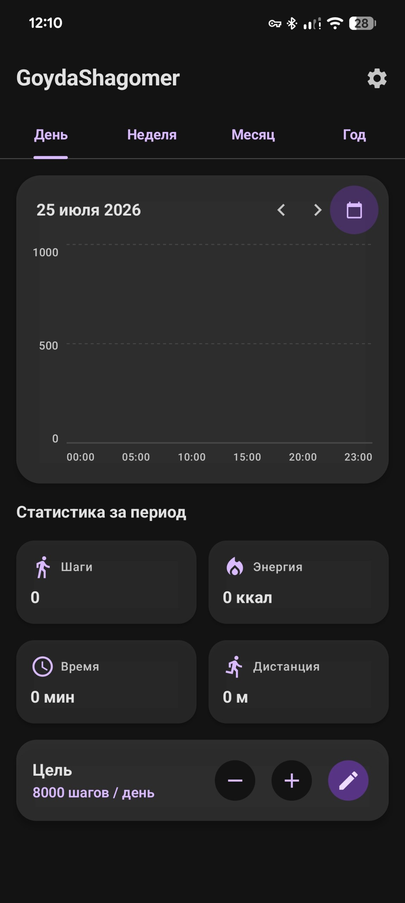
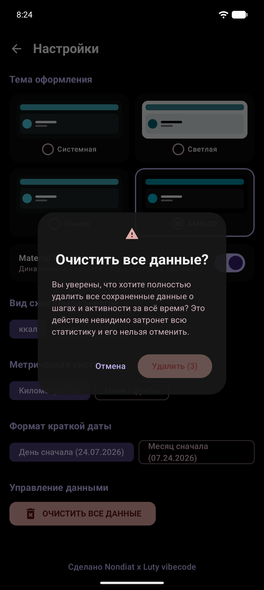

# GoydaShagomer (ГойдаШагомер) 🏃‍♂️

Современное, премиальное Android-приложение для точного подсчета шагов, отслеживания активности и сжигаемой энергии, созданное на **Jetpack Compose** и **Material 3**.

---

## 📱 Скриншоты приложения

| Главный экран (Чистый запуск) | Настройки и подтверждение очистки |
| :---: | :---: |
|  |  |

---

## ✨ Ключевые возможности

- 📊 **Интерактивная статистика**: Почасовые и суточные графики активности, пройденное расстояние и сожженная энергия.
- 🚶 **Точный подсчет шагов**: Автоматическая обработка аппаратных сенсоров `TYPE_STEP_COUNTER` и `TYPE_STEP_DETECTOR`.
- ⚙️ **Гибкая настройка единиц**:
  - Метрическая и имперская системы (метры для <1 км, километры с точностью 0.01 км при ≥1 км; милли/футы).
  - Единицы энергии: **ккал**, **кал**, **кДж**.
  - Форматы дат: `ДД.ММ.ГГГГ` или `ММ.ДД.ГГГГ`.
- 🎨 **Тема AMOLED & Material You**:
  - Полная поддержка динамических цветов Android 12+ (акценты адаптируются под системные обои).
  - Настоящий глубокий черный цвет (`#000000`) в режиме **AMOLED** для экономии заряда батареи.
- 🧩 **Виджет для Pixel Launcher**:
  - Адаптивный виджет `2x2` с кольцевым прогрессом и динамическими системными акцентами `Material You`.
- 🛡 **Безопасная очистка данных**:
  - Красная кнопка **«ОЧИСТИТЬ ВСЕ ДАННЫЕ»** с выравниванием по левой стороне.
  - Всплывающее подтверждающее окно с **3-секундным таймером обратного отсчета** на кнопке удаления во избежание случайного сброса.

Сделано нейросетью через Antigravity на модели Gemini 3.6 Flash
